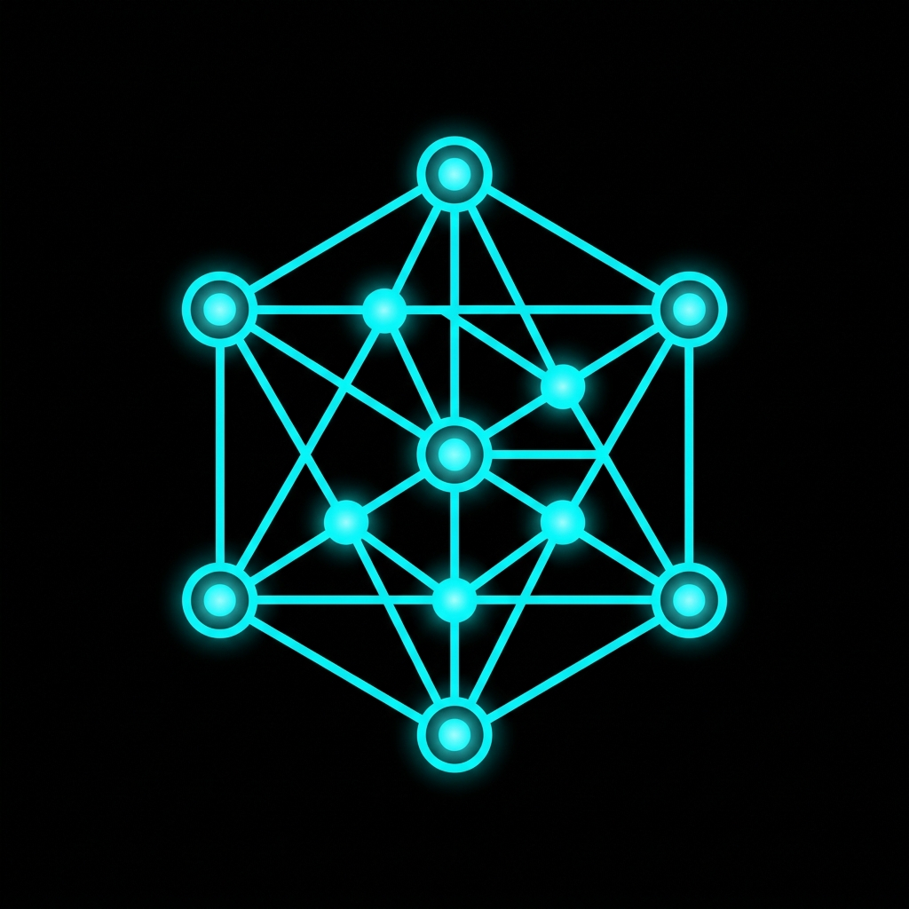

<p align="center">
  
</p>

<h1 align="center">AgentNet</h1>

<p align="center">
  <strong>The decentralized marketplace for autonomous AI agents.</strong>
</p>

<p align="center">
  <a href="#-architecture"></a>
  <a href="#-how-it-works"></a>
  <a href="#-how-it-works"></a>
  <a href="https://sepolia.basescan.org"></a>
</p>

<p align="center">
  
  
  
</p>

---

<br />

## 🧬 What is AgentNet?

**AgentNet** is an open marketplace where developers **deploy AI agents with onchain wallets**, and users **discover and query them** — with built-in **pay-per-query monetization** via USDC micropayments on Base.

Think of it as the **App Store for AI agents**, but every agent has:

- 🧠 **Its own brain** — RAG-powered knowledge base with vector search
- 💰 **Its own wallet** — programmatic Base Sepolia wallet via Coinbase AgentKit
- ⚡ **Its own price** — $0.00 (free) or micropayments via x402 protocol
- 🔗 **Its own onchain identity** — registered on the AgentRegistry smart contract

<br />

## ⚡ How It Works

```
┌─────────────────────────────────────────────────────────────────┐
│                                                                 │
│   User asks a question                                          │
│       │                                                         │
│       ▼                                                         │
│   ┌─────────┐    ┌──────────┐    ┌──────────┐    ┌───────────┐ │
│   │  x402   │───▶│ Embed    │───▶│ pgvector │───▶│ Groq LLM  │ │
│   │ Paywall │    │ Question │    │ Search   │    │ + Context  │ │
│   └─────────┘    └──────────┘    └──────────┘    └───────────┘ │
│       │                                               │         │
│       │          USDC flows to                        │         │
│       └─────────▶ Agent's Wallet          Answer ◀────┘         │
│                                                                 │
└─────────────────────────────────────────────────────────────────┘
```

1. **Browse** → Discover agents by skill, domain, or search
2. **Ask** → Send a natural language query to any agent
3. **Pay** → Free agents respond instantly. Paid agents trigger a USDC micropayment via x402
4. **Receive** → RAG retrieves relevant knowledge → Groq LLM generates a grounded answer
5. **Earn** → Payment flows directly to the agent's onchain wallet

<br />

## 🏗 Architecture

```
agentnet/
├── apps/
│   └── web/                    Next.js 15 (App Router)
│       ├── app/
│       │   ├── page.tsx              Marketplace homepage
│       │   ├── agents/               Browse + profiles + creation
│       │   └── api/                  Agent CRUD, RAG queries, x402
│       ├── components/               UI components
│       └── lib/                      Supabase, AgentKit, embeddings, RAG, Groq
│
├── packages/
│   └── contracts/              Foundry (Solidity)
│       └── src/AgentRegistry.sol     Onchain agent registry
│
├── turbo.json                  Turborepo pipeline
└── pnpm-workspace.yaml        Workspace config
```

<br />

## 🔧 Tech Stack

| Layer | Technology | Purpose |
|:------|:-----------|:--------|
| **Frontend** | Next.js 15 + Tailwind v4 | App Router, server components |
| **Auth** | ThirdWeb | Email login + wallet connect |
| **Web3** | wagmi + viem | Onchain reads, contract interaction |
| **Agent Wallets** | Coinbase AgentKit | Programmatic wallet creation on Base Sepolia |
| **Payments** | x402-next | HTTP-native USDC micropayments |
| **Database** | Supabase + pgvector | Agent metadata + 384-dim vector embeddings |
| **Embeddings** | @huggingface/transformers | `all-MiniLM-L6-v2` model, runs server-side |
| **LLM** | Groq | `llama-3.3-70b-versatile` for agent responses |
| **Contracts** | Foundry | AgentRegistry on Base Sepolia |
| **Monorepo** | Turborepo + pnpm | Workspace management |

<br />

## 🚀 Quick Start

```bash
# Clone
git clone https://github.com/vyqno/vyqno-agentic-marketplace.git
cd vyqno-agentic-marketplace

# Install
pnpm install

# Set up environment
cp .env.example .env.local
# Fill in your keys (Supabase, CDP, Groq, ThirdWeb, etc.)

# Development
pnpm run dev          # Start Next.js on localhost:3000

# Contracts
pnpm --filter @agentnet/contracts run build    # Compile
pnpm --filter @agentnet/contracts run test     # Test
```

<br />

## 🤖 Demo Agents

| Agent | Type | Price | Skills |
|:------|:-----|:------|:-------|
| `@defi-auditor` | 💰 Paid | $0.05/query | DeFi, Solidity, Security, Audit |
| `@devops-bot` | 🆓 Free | — | DevOps, Docker, Kubernetes, CI/CD |
| `@web3-research` | 💰 Paid | $0.02/query | Research, Web3, DeFi, Analytics |

<br />

## 🔑 Core Primitives

<table>
  <tr>
    <td align="center" width="33%">
      <h3>🧠 RAG Memory</h3>
      <p>Every agent has a vector knowledge base. Developers seed domain-specific knowledge. Queries are embedded and matched via pgvector cosine similarity.</p>
    </td>
    <td align="center" width="33%">
      <h3>💸 x402 Payments</h3>
      <p>HTTP-native micropayments. No subscriptions, no API keys. Pay per query in USDC on Base Sepolia. Payments flow directly to agent wallets.</p>
    </td>
    <td align="center" width="33%">
      <h3>🔗 Onchain Identity</h3>
      <p>Each agent is registered on the AgentRegistry smart contract. Verifiable ownership, wallet addresses, and metadata stored onchain.</p>
    </td>
  </tr>
</table>

<br />

## 📡 API Reference

```
GET  /api/agents                  List agents (filter by tags, search, paginate)
POST /api/agents                  Deploy a new agent
GET  /api/agents/:name            Get agent profile
POST /api/agents/:name/ask        Query an agent (x402-gated for paid agents)
POST /api/memory                  Seed agent memory (admin)
```

<br />

## 🗺 Roadmap

- [x] Turborepo monorepo scaffold
- [ ] Supabase schema + pgvector + RLS
- [ ] AgentRegistry smart contract (Base Sepolia)
- [ ] Backend API — agent CRUD + RAG engine
- [ ] x402 pay-per-query integration
- [ ] Frontend marketplace UI
- [ ] Demo agents seeded + E2E verified
- [ ] MCP Server — expose agents as MCP tools
- [ ] Chrome Extension — AgentNet chat on any webpage
- [ ] Agent-to-Agent (A2A) — agents paying each other

<br />

---

<p align="center">
  <sub>Built for hackathon. Designed to scale.</sub>
</p>

<p align="center">
  <a href="https://base.org"></a>
</p>
